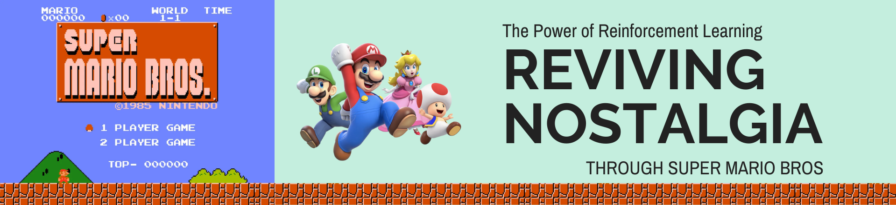
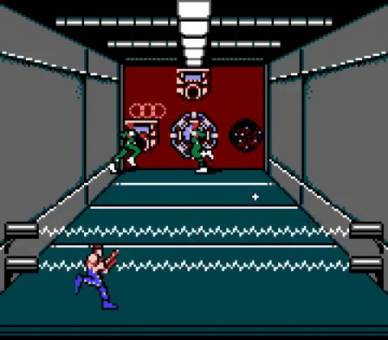
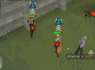
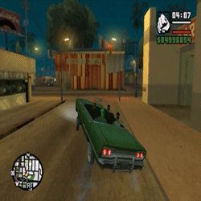
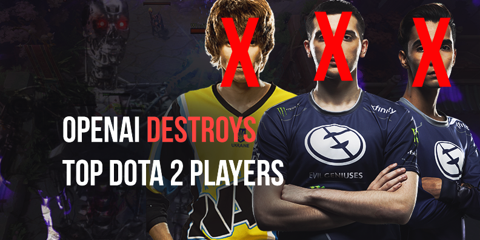
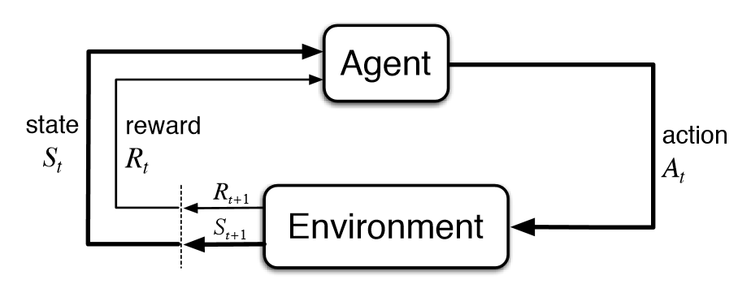
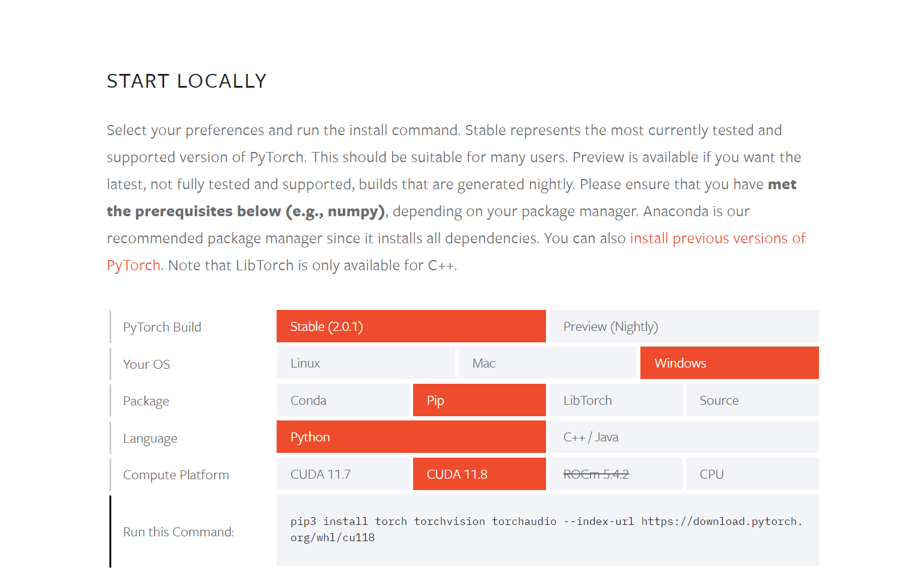
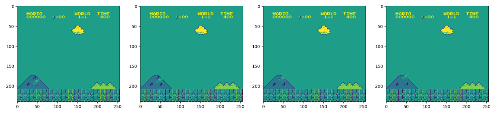

by: BJ Enrik Yepes

Gaming has always been an integral part of my life, providing entertainment, escapism, and even valuable life lessons. The impact of gaming on my personal growth and development cannot be understated. From the humble beginnings of classic 8-bit NES games, where I first discovered the joy of gaming, to the immersive world of Pokémon on the portable Game Boy, and the revolutionary leap into the console era with the iconic PlayStation 2, each era has left an indelible mark on my gaming journey. I spent countless hours immersed in the vast virtual landscapes of browser-based MMORPGs like RuneScape, forging friendships and memories that still resonate with me today. And then there was Dota 2, the pinnacle of competitive gaming that captivated me with its strategic depth and electrifying gameplay.

<div style="display: flex; align-items: left;">
    
    
    
    
    
</div>


<center>From left to right: Contra (1987), Pokemon: Sapphire version (2002), Runescape (2007), GTA: San Andreas (2004)</center>

However, as technology progresses, so does the gaming industry. One significant breakthrough that has reshaped the landscape is the integration of reinforcement learning. This cutting-edge approach has unlocked new possibilities and pushed the boundaries of what is achievable in gaming. It is a game-changer that allows machines to learn, adapt, and excel at games through their own experiences.

In recent years, OpenAI, a leading artificial intelligence research organization, has harnessed the power of reinforcement learning to create game-playing bots that have surpassed even the most skilled human players in games like Dota 2. This groundbreaking achievement showcases the immense potential of reinforcement learning in revolutionizing the gaming landscape. [1, 4]




<center> <b>Image Source:</b> <a href=https://www.esportstalk.com/news/openai-at-the-international-2019/>OpenAI at The International 2019</center>

However, as much as I am fascinated by the advancements in complex games like Dota 2, I wanted to take a step back and revisit the classic games that shaped my gaming journey. That's where Super Mario and NES games come into play. These timeless classics hold a special place in the hearts of many gaming enthusiasts, evoking a sense of nostalgia and bringing back memories of simpler times.

In this blog post, we will dive into the captivating world of Super Mario Bros, exploring how reinforcement learning can be applied to this beloved title. By combining the familiarity of our childhood favorite with the cutting-edge techniques of reinforcement learning, we embark on a unique journey that bridges the gap between the past and the present. Join me as we discover the transformative power of reinforcement learning and witness how it breathes new life into the games that shaped our gaming passion.

# Reinforment Learning Explained!

There have been several mentions of reinforcement learning already, but what exactly is it? Reinforcement learning is a branch of machine learning that involves training an agent to make sequential decisions based on trial and error. In simple terms, it's like teaching a computer program to learn from its own experiences and interactions with the environment, just like how we learn from rewards and consequences in our daily lives. [4]

For example, imagine training an AI to play a game of Super Mario. The AI starts off knowing nothing about the game, but through trial and error, it learns which actions lead to rewards (collecting coins, avoiding enemies) and which actions lead to negative outcomes (losing lives, falling into pits). Over time, the AI becomes better at playing the game by maximizing its rewards and minimizing its mistakes.

Here, Figure 1 illustrates the fundamental reinforcement learning cycle, which consists of the following steps [2]:

1. **`Observation:`** The agent perceives the state of the environment through observations or sensory inputs.

2. **`Action:`** Based on the observed state, the agent selects an action to take.

3. **`Environment:`** The agent interacts with the environment by executing the chosen action.

4. **`Reward:`** After performing the action, the agent receives a reward or feedback from the environment indicating the desirability of its action.

5. **`Next State:`** The environment transitions to a new state as a result of the agent's action.

6. **`Learning:`** The agent updates its knowledge or policy based on the observed state, action, reward, and the resulting next state.

7. **`Iteration:`** The cycle repeats as the agent continues to observe, act, receive rewards, and learn from its interactions with the environment.



<center>Figure 1. Reinforcement Learning Cycle</center>

<center>Source: Shehab, Mohammad & Khader, Ahamad Tajudin & Alia, Mohammad. (2019). Enhancing Cuckoo Search Algorithm by using Reinforcement Learning for Constrained Engineering optimization Problems. 812-816. 10.1109/JEEIT.2019.8717366. </center>

# Terminology Alert!

Before diving into the code, let's familiarize ourselves with some key terminologies that will be used throughout this blog post [5]:

- **`Agent:`** The entity that interacts with the environment. In our case, the agent is the AI or computer program that learns to play the game.

- **`Environment:`** The virtual world or game in which the agent operates. It provides the agent with observations and receives actions from the agent.

- **`State:`** The current representation of the environment that the agent observes. It contains information about the agent's position, objects in the game, and other relevant details.

- **`Action:`** The decision or choice made by the agent in response to the observed state. It determines the agent's next move in the game.

- **`Reward:`** The feedback or score received by the agent after taking an action. It serves as a measure of how well the agent is performing. Positive rewards are typically given for desirable actions, while negative rewards are given for undesirable actions.

- **`Policy:`** The strategy or set of rules that the agent follows to select actions based on the observed state. It maps states to actions.

- **`Episode:`** A complete sequence of interactions between the agent and the environment, starting from an initial state and ending in a terminal state or goal.

# Getting Started!

## Library Installation

To begin, we need to install two essential components: the Super Mario Bros environment from `gym` and `nes_py`. But why are these installations necessary?

Think of `gym_super_mario_bros` as the game cartridge that brings the Super Mario Bros environment to life within the reinforcement learning context. It acts as a bridge that allows us to simulate and interact with the Super Mario Bros game seamlessly, all within the realm of our code. [8]

Learn more about gym_super_mario_bros here: <a href=https://pypi.org/project/gym-super-mario-bros/>Super Mario Bros. for OpenAI Gym</a>

On the other hand, `nes_py` can be seen as the actual console or emulator, along with the controller, that enables us to fully engage with NES (Nintendo Entertainment System) games. It provides a comprehensive set of tools and interfaces, allowing us to load and manipulate NES ROMs and effortlessly interact with the game environments. [9]

Learn more about nes_py here: <a href=https://pypi.org/project/nes-py/>An NES Emulator and OpenAI Gym interface</a>


```python
!pip install gym_super_mario_bros==7.3.0 nes_py
```

`gym_super_mario_bros` and `stable_baselines3` are both libraries that rely on PyTorch as one of their dependencies. When you install these libraries using pip or any package manager, PyTorch will be automatically installed as a dependency if it is not already present in your environment.

However, it's important to note that PyTorch itself needs to be installed separately if you plan to fully utilize the power of GPU for accelerated training, we need to perform a custom installation of PyTorch. The default PyTorch installation from the libraries we are using today only includes the CPU version, which limits us to CPU as the compute platform.

For the PyTorch installation, you can refer to the official PyTorch website at: <a href=https://pytorch.org/get-started/locally/>PyTorch Installation</a>. This link provides detailed instructions on how to install PyTorch locally.



In my case, I required a stable PyTorch build for Windows OS, preferred to use Pip as the installer, utilized Python as the programming language, and currently had CUDA version 11.8 installed.


```python
# Install pytorch
!pip3 install torch torchvision torchaudio --index-url https://download.pytorch.org/whl/cu118
```

Lastly, we need to install `stable-baselines3[extra]` in order to use the Stable Baselines3 library, which provides high-level implementations of various reinforcement learning algorithms. This library extends the functionality of OpenAI Gym and makes it easier to train and evaluate RL agents.


```python
# Install stable baselines for RL stuff
!pip install stable-baselines3[extra]
```

## Setting up the Environment

Let's set up our environment! By default, allowing our agent to play in the full Super Mario Bros environment is very much possible but it would be computationally expensive.

Imagine the immense number of possible button combinations our agent could make — 256 to be exact! That's a lot of actions to process. Not to mention, the RGB layers would require significant computational resources.

We are going to take a smarter approach to save computational power.

**Reducing the Actions**
- We have reduced the number of possible button combinations from 256 to just 7, making it easier for our agent to learn and make decisions.

**Grayscale Gameplay**
- Working with a single channel means we only need to process 33% of the original data from the environment, reducing the computational load significantly.


```python
# Import super mario bros
import gym_super_mario_bros

# Import joypad wrapper
from nes_py.wrappers import JoypadSpace

# Import simplified controls
from gym_super_mario_bros.actions import SIMPLE_MOVEMENT

# Import Frame Stacker Wrapper and GrayScaling Wrapper
from gym.wrappers import GrayScaleObservation
```


```python
# 1. Create the base environment
env = gym_super_mario_bros.make('SuperMarioBros-v0')

# 2. Simplify the controls 
env = JoypadSpace(env, SIMPLE_MOVEMENT)

# 3. Grayscale
env = GrayScaleObservation(env, keep_dim=True)
```

Next, we take two important steps to enhance our environment: ensuring compatibility with Stable Baselines3 and providing our agent with a temporal understanding of the game.

**Compatibility**
- To seamlessly integrate our environment with the Stable Baselines3 library, we wrap it in a DummyVecEnv, enabling smooth compatibility with the required vectorized environment.

**Temporal Understanding**
- By stacking multiple consecutive frames, we empower our agent with a temporal understanding of the game, allowing it to perceive dynamic changes and motion. In this case, we stack 4 frames together.


```python
# Import Vectorization Wrappers
from stable_baselines3.common.vec_env import VecFrameStack, DummyVecEnv
```


```python
# 4. Wrap inside the Dummy Environment
env = DummyVecEnv([lambda: env])

# 5. Stack the frames
env = VecFrameStack(env, 4, channels_order='last')
```

To provide a visual understanding of our grayscale environment stacked four times, take a look at this illustration. It showcases the temporal progression of Mario's actions, specifically his jumps, across a duration of four frames.



# The Training Arc!

Similar to gamers, our agent embarks on an intense training arc to improve its gaming skills. The key difference? The agent operates at accelerated speeds and can tackle multiple instances of the game simultaneously, granting it an unfair advantage.

Now, let's delve into the training process. We have chosen the `Proximal Policy Optimization` (PPO) algorithm as our training strategy [3]. Think of PPO as the guiding principle that shapes our agent's learning journey.


```python
# Import PPO for algos
from stable_baselines3 import PPO
```

## Selecting the Algorithm

We have opted for the `CnnPolicy` as our chosen policy for the PPO algorithm. The CnnPolicy utilizes a convolutional neural network architecture, which is well-suited for processing visual input from the game environment.

You can think of the "CnnPolicy" in PPO as the playbook or strategy that the agent follows during the game. Just like in sports, where teams have different playbooks or strategies tailored to their strengths and the game conditions, the "CnnPolicy" serves as the specific game plan for our agent in the context of reinforcement learning. It outlines how the agent should process and interpret visual input from the game environment using convolutional neural networks, allowing it to make informed decisions and take appropriate actions.

**Learning Rate**
- To control the learning process, we have set a learning rate of 1e-5. A lower learning rate implies slower but more precise updates to the model's parameters, while a higher learning rate may lead to faster updates but potentially overshooting optimal solutions.

**Number of Steps**
- The n_steps parameter, set to 512 in our case, determines the number of steps taken in each iteration of the training process. It influences the trade-off between exploration and exploitation in reinforcement learning. A larger value allows for more exploration but increases the computational cost.


```python
# This is the AI model
model = PPO('CnnPolicy', env, verbose=1, learning_rate=1e-5, 
            n_steps=512) 
```

    Using cuda device
    Wrapping the env in a VecTransposeImage.
    

## Model Training

Now let's dive into the actual training process. Training in this context refers to the iterative process of optimizing our model's parameters based on interactions with the environment to improve its performance.

In this case, we will set a total of 10,000 timesteps as the training duration. During these timesteps, our agent will actively explore and learn from its interactions with the environment, gradually improving its gameplay skills and decision-making abilities.


```python
# Train the AI model, this is where the AI model starts to learn
model.learn(total_timesteps=10000)
```

    C:\Users\Stellar\mambaforge\envs\nlp\lib\site-packages\gym_super_mario_bros\smb_env.py:148: RuntimeWarning: overflow encountered in ubyte_scalars
      return (self.ram[0x86] - self.ram[0x071c]) % 256
    

    ----------------------------
    | time/              |     |
    |    fps             | 63  |
    |    iterations      | 1   |
    |    time_elapsed    | 8   |
    |    total_timesteps | 512 |
    ----------------------------
    ------------------------------------------
    | time/                   |              |
    |    fps                  | 60           |
    |    iterations           | 2            |
    |    time_elapsed         | 16           |
    |    total_timesteps      | 1024         |
    | train/                  |              |
    |    approx_kl            | 0.0067711715 |
    |    clip_fraction        | 0.0416       |
    |    clip_range           | 0.2          |
    |    entropy_loss         | -1.94        |
    |    explained_variance   | 0.000533     |
    |    learning_rate        | 1e-05        |
    |    loss                 | 156          |
    |    n_updates            | 10           |
    |    policy_gradient_loss | -0.00741     |
    |    value_loss           | 425          |
    ------------------------------------------
    -----------------------------------------
    | time/                   |             |
    |    fps                  | 61          |
    |    iterations           | 3           |
    |    time_elapsed         | 24          |
    |    total_timesteps      | 1536        |
    | train/                  |             |
    |    approx_kl            | 0.012825324 |
    |    clip_fraction        | 0.0459      |
    |    clip_range           | 0.2         |
    |    entropy_loss         | -1.94       |
    |    explained_variance   | 0.663       |
    |    learning_rate        | 1e-05       |
    |    loss                 | 0.205       |
    |    n_updates            | 20          |
    |    policy_gradient_loss | -0.00957    |
    |    value_loss           | 3.57        |
    -----------------------------------------
    ------------------------------------------
    | time/                   |              |
    |    fps                  | 62           |
    |    iterations           | 4            |
    |    time_elapsed         | 33           |
    |    total_timesteps      | 2048         |
    | train/                  |              |
    |    approx_kl            | 0.0032713115 |
    |    clip_fraction        | 0            |
    |    clip_range           | 0.2          |
    |    entropy_loss         | -1.93        |
    |    explained_variance   | -0.104       |
    |    learning_rate        | 1e-05        |
    |    loss                 | 0.247        |
    |    n_updates            | 30           |
    |    policy_gradient_loss | -0.0022      |
    |    value_loss           | 2.05         |
    ------------------------------------------
    ------------------------------------------
    | time/                   |              |
    |    fps                  | 62           |
    |    iterations           | 5            |
    |    time_elapsed         | 40           |
    |    total_timesteps      | 2560         |
    | train/                  |              |
    |    approx_kl            | 0.0030697347 |
    |    clip_fraction        | 0            |
    |    clip_range           | 0.2          |
    |    entropy_loss         | -1.92        |
    |    explained_variance   | 0.19         |
    |    learning_rate        | 1e-05        |
    |    loss                 | 0.162        |
    |    n_updates            | 40           |
    |    policy_gradient_loss | -0.00248     |
    |    value_loss           | 1.09         |
    ------------------------------------------
    ------------------------------------------
    | time/                   |              |
    |    fps                  | 63           |
    |    iterations           | 6            |
    |    time_elapsed         | 48           |
    |    total_timesteps      | 3072         |
    | train/                  |              |
    |    approx_kl            | 0.0028998037 |
    |    clip_fraction        | 0            |
    |    clip_range           | 0.2          |
    |    entropy_loss         | -1.93        |
    |    explained_variance   | 0.0382       |
    |    learning_rate        | 1e-05        |
    |    loss                 | 0.0972       |
    |    n_updates            | 50           |
    |    policy_gradient_loss | -0.00107     |
    |    value_loss           | 0.806        |
    ------------------------------------------
    ------------------------------------------
    | time/                   |              |
    |    fps                  | 63           |
    |    iterations           | 7            |
    |    time_elapsed         | 56           |
    |    total_timesteps      | 3584         |
    | train/                  |              |
    |    approx_kl            | 0.0019584578 |
    |    clip_fraction        | 0            |
    |    clip_range           | 0.2          |
    |    entropy_loss         | -1.92        |
    |    explained_variance   | -0.046       |
    |    learning_rate        | 1e-05        |
    |    loss                 | 0.0666       |
    |    n_updates            | 60           |
    |    policy_gradient_loss | -0.0014      |
    |    value_loss           | 0.712        |
    ------------------------------------------
    -----------------------------------------
    | time/                   |             |
    |    fps                  | 63          |
    |    iterations           | 8           |
    |    time_elapsed         | 64          |
    |    total_timesteps      | 4096        |
    | train/                  |             |
    |    approx_kl            | 0.001788438 |
    |    clip_fraction        | 0           |
    |    clip_range           | 0.2         |
    |    entropy_loss         | -1.92       |
    |    explained_variance   | -0.0812     |
    |    learning_rate        | 1e-05       |
    |    loss                 | 0.0999      |
    |    n_updates            | 70          |
    |    policy_gradient_loss | -0.000417   |
    |    value_loss           | 0.545       |
    -----------------------------------------
    ------------------------------------------
    | time/                   |              |
    |    fps                  | 63           |
    |    iterations           | 9            |
    |    time_elapsed         | 72           |
    |    total_timesteps      | 4608         |
    | train/                  |              |
    |    approx_kl            | 0.0033264707 |
    |    clip_fraction        | 0            |
    |    clip_range           | 0.2          |
    |    entropy_loss         | -1.91        |
    |    explained_variance   | -0.04        |
    |    learning_rate        | 1e-05        |
    |    loss                 | 0.083        |
    |    n_updates            | 80           |
    |    policy_gradient_loss | -0.000945    |
    |    value_loss           | 0.449        |
    ------------------------------------------
    ------------------------------------------
    | time/                   |              |
    |    fps                  | 63           |
    |    iterations           | 10           |
    |    time_elapsed         | 80           |
    |    total_timesteps      | 5120         |
    | train/                  |              |
    |    approx_kl            | 0.0007790753 |
    |    clip_fraction        | 0            |
    |    clip_range           | 0.2          |
    |    entropy_loss         | -1.89        |
    |    explained_variance   | 0.0988       |
    |    learning_rate        | 1e-05        |
    |    loss                 | 0.129        |
    |    n_updates            | 90           |
    |    policy_gradient_loss | -0.000786    |
    |    value_loss           | 0.327        |
    ------------------------------------------
    -----------------------------------------
    | time/                   |             |
    |    fps                  | 64          |
    |    iterations           | 11          |
    |    time_elapsed         | 87          |
    |    total_timesteps      | 5632        |
    | train/                  |             |
    |    approx_kl            | 0.005427646 |
    |    clip_fraction        | 0           |
    |    clip_range           | 0.2         |
    |    entropy_loss         | -1.91       |
    |    explained_variance   | 0.00718     |
    |    learning_rate        | 1e-05       |
    |    loss                 | 0.0855      |
    |    n_updates            | 100         |
    |    policy_gradient_loss | -0.00424    |
    |    value_loss           | 0.343       |
    -----------------------------------------
    -----------------------------------------
    | time/                   |             |
    |    fps                  | 64          |
    |    iterations           | 12          |
    |    time_elapsed         | 95          |
    |    total_timesteps      | 6144        |
    | train/                  |             |
    |    approx_kl            | 0.013949446 |
    |    clip_fraction        | 0.0518      |
    |    clip_range           | 0.2         |
    |    entropy_loss         | -1.91       |
    |    explained_variance   | -0.00593    |
    |    learning_rate        | 1e-05       |
    |    loss                 | 0.0841      |
    |    n_updates            | 110         |
    |    policy_gradient_loss | -0.00794    |
    |    value_loss           | 0.235       |
    -----------------------------------------
    ------------------------------------------
    | time/                   |              |
    |    fps                  | 64           |
    |    iterations           | 13           |
    |    time_elapsed         | 103          |
    |    total_timesteps      | 6656         |
    | train/                  |              |
    |    approx_kl            | 0.0008680193 |
    |    clip_fraction        | 0.00332      |
    |    clip_range           | 0.2          |
    |    entropy_loss         | -1.89        |
    |    explained_variance   | -0.00568     |
    |    learning_rate        | 1e-05        |
    |    loss                 | 0.0709       |
    |    n_updates            | 120          |
    |    policy_gradient_loss | 0.00136      |
    |    value_loss           | 0.237        |
    ------------------------------------------
    -----------------------------------------
    | time/                   |             |
    |    fps                  | 64          |
    |    iterations           | 14          |
    |    time_elapsed         | 111         |
    |    total_timesteps      | 7168        |
    | train/                  |             |
    |    approx_kl            | 0.004216737 |
    |    clip_fraction        | 0.00918     |
    |    clip_range           | 0.2         |
    |    entropy_loss         | -1.9        |
    |    explained_variance   | 0.00112     |
    |    learning_rate        | 1e-05       |
    |    loss                 | 0.0824      |
    |    n_updates            | 130         |
    |    policy_gradient_loss | -0.00241    |
    |    value_loss           | 0.209       |
    -----------------------------------------
    -----------------------------------------
    | time/                   |             |
    |    fps                  | 64          |
    |    iterations           | 15          |
    |    time_elapsed         | 118         |
    |    total_timesteps      | 7680        |
    | train/                  |             |
    |    approx_kl            | 0.007423834 |
    |    clip_fraction        | 0.0121      |
    |    clip_range           | 0.2         |
    |    entropy_loss         | -1.9        |
    |    explained_variance   | 0.000339    |
    |    learning_rate        | 1e-05       |
    |    loss                 | 0.0723      |
    |    n_updates            | 140         |
    |    policy_gradient_loss | -0.00603    |
    |    value_loss           | 0.238       |
    -----------------------------------------
    -----------------------------------------
    | time/                   |             |
    |    fps                  | 64          |
    |    iterations           | 16          |
    |    time_elapsed         | 126         |
    |    total_timesteps      | 8192        |
    | train/                  |             |
    |    approx_kl            | 0.005285054 |
    |    clip_fraction        | 0           |
    |    clip_range           | 0.2         |
    |    entropy_loss         | -1.85       |
    |    explained_variance   | 0.000817    |
    |    learning_rate        | 1e-05       |
    |    loss                 | 0.0856      |
    |    n_updates            | 150         |
    |    policy_gradient_loss | -0.00344    |
    |    value_loss           | 0.188       |
    -----------------------------------------
    -----------------------------------------
    | time/                   |             |
    |    fps                  | 64          |
    |    iterations           | 17          |
    |    time_elapsed         | 134         |
    |    total_timesteps      | 8704        |
    | train/                  |             |
    |    approx_kl            | 0.057824735 |
    |    clip_fraction        | 0.28        |
    |    clip_range           | 0.2         |
    |    entropy_loss         | -1.74       |
    |    explained_variance   | 0.00433     |
    |    learning_rate        | 1e-05       |
    |    loss                 | 140         |
    |    n_updates            | 160         |
    |    policy_gradient_loss | 0.0179      |
    |    value_loss           | 414         |
    -----------------------------------------
    ------------------------------------------
    | time/                   |              |
    |    fps                  | 64           |
    |    iterations           | 18           |
    |    time_elapsed         | 141          |
    |    total_timesteps      | 9216         |
    | train/                  |              |
    |    approx_kl            | 0.0027298238 |
    |    clip_fraction        | 0            |
    |    clip_range           | 0.2          |
    |    entropy_loss         | -1.71        |
    |    explained_variance   | 0.0106       |
    |    learning_rate        | 1e-05        |
    |    loss                 | 23.9         |
    |    n_updates            | 170          |
    |    policy_gradient_loss | -0.000897    |
    |    value_loss           | 45.5         |
    ------------------------------------------
    ----------------------------------------
    | time/                   |            |
    |    fps                  | 65         |
    |    iterations           | 19         |
    |    time_elapsed         | 149        |
    |    total_timesteps      | 9728       |
    | train/                  |            |
    |    approx_kl            | 0.02091333 |
    |    clip_fraction        | 0.25       |
    |    clip_range           | 0.2        |
    |    entropy_loss         | -1.51      |
    |    explained_variance   | 0.0455     |
    |    learning_rate        | 1e-05      |
    |    loss                 | 117        |
    |    n_updates            | 180        |
    |    policy_gradient_loss | 0.0146     |
    |    value_loss           | 342        |
    ----------------------------------------
    ----------------------------------------
    | time/                   |            |
    |    fps                  | 65         |
    |    iterations           | 20         |
    |    time_elapsed         | 157        |
    |    total_timesteps      | 10240      |
    | train/                  |            |
    |    approx_kl            | 0.01459413 |
    |    clip_fraction        | 0.102      |
    |    clip_range           | 0.2        |
    |    entropy_loss         | -1.56      |
    |    explained_variance   | 0.119      |
    |    learning_rate        | 1e-05      |
    |    loss                 | 33.3       |
    |    n_updates            | 190        |
    |    policy_gradient_loss | -0.0158    |
    |    value_loss           | 82.7       |
    ----------------------------------------
    


    <stable_baselines3.ppo.ppo.PPO at 0x1f0633751e0>


# Game Time!

Our agent has completed its training phase, and now it's time to evaluate how much it has learned. We can truly witness its progress by observing its gameplay in action as it tackles the challenges of Super Mario Bros. Let's sit back and enjoy watching our agent showcase its newfound skills.


```python
# Start the game 
state = env.reset()
# Loop through the game
while True: 
    
    action, _ = model.predict(state)
    state, reward, done, info = env.step(action)
    env.render()
```

Here, we present a series of gameplay videos showcasing the agent's performance at different stages of training: random movement, as well as trained models at 10,000, 100,000, 1 million, 4 million, 5 million, and 9 million timesteps.

During the experimentation with different hyperparameters, it became apparent that a necessary adjustment was required for the model. The learning rate of 1e-5 was deemed too high, impacting the agent's performance. Lower learning rates, such as 1e-6 or 1e-7, yielded better results. For instance, when trained with a learning rate of 1e-6, the supermario agent managed to clear world 1-1 within just 4 million timesteps. The expectation of achieving the same result with a learning rate of 1e-5 proved unsuccessful.

Furthermore, increasing the number of timesteps did not lead to convergence to a desirable local minimum when combined with higher learning rates. These findings highlight the significance of fine-tuning hyperparameters to optimize the agent's learning process and overall performance.

<center><video controls src="mario_gameplay.mp4" width="960" height="540" /></center>

# Final Thoughts

That was a simple and elegant demonstration of reinforcement learning in action, showcasing the power of abstraction and automation. By utilizing libraries like Stable Baselines3 and Gym Super Mario Bros, we were able to implement RL without explicitly coding complex functions.

While this implementation focused on the Super Mario environment, the potential for further extension and customization is vast. By incorporating automatic model saving, increasing training steps, customizing reward systems, adjusting learning rates and step sizes, and more, we can create more sophisticated and specialized AI agents.

This comprehensive backbone implementation of reinforcement learning using the Super Mario environment serves as a gateway into the realm of RL. Whether you're a gamer or an AI enthusiast, the possibilities are endless. Perhaps we can even explore the realm of speedrunner AI, inspired by OpenAI's feat of defeating professional players in Dota 2. The realm of AI offers boundless opportunities for exploration and exploitation.

If you're interested in a more in-depth technical report-style code, detailing an extended version of this implementation, feel free to visit my GitHub repository through this link:

https://github.com/BJEnrik/super_mario_RL/tree/main

# References

**Original Papers**

[1] Berner, C., Brockman, G., Chan, B., et.al (2019). Dota 2 with Large Scale Deep Reinforcement Learning. OpenAI. Retrieved from https://cdn.openai.com/dota-2.pdf

[2] Shehab, Mohammad & Khader, Ahamad Tajudin & Alia, Mohammad. (2019). Enhancing Cuckoo Search Algorithm by using Reinforcement Learning for Constrained Engineering optimization Problems. 812-816. 10.1109/JEEIT.2019.8717366. Retrieved from https://www.researchgate.net/publication/333228448_Enhancing_Cuckoo_Search_Algorithm_by_using_Reinforcement_Learning_for_Constrained_Engineering_optimization_Problems

[3] Schulman, J., Wolski, F., Dhariwal, P., Radford, A., Klimov, O. Proximal Policy Optimization Algorithms. Retrieved from https://arxiv.org/abs/1707.06347

</br>

**Articles**

[4] Muresan, R. (2019). OpenAI at The International 2019. EsportsTalk. Retrieved from https://www.esportstalk.com/news/openai-at-the-international-2019/

[5] Joby, A. (2021). Reinforcement Learning: How Machines Learn From Their Mistakes. G2 Business Software Reviews. Retrieved from https://www.g2.com/articles/reinforcement-learning


</br>

**Tutorials and Documentations**

[6] Feng, Y., Subramanian, S., Wang, H., Guo, S. (n.d.). TRAIN A MARIO-PLAYING RL AGENT. PyTorch Tutorials. Retrieved from https://pytorch.org/tutorials/intermediate/mario_rl_tutorial.html

[7] Renotte, N. (2021). Mario RL. Retrieved from https://github.com/nicknochnack/MarioRL

[8] gym-super-mario-bros 7.4.0. (2022). The Python Package Index. Retrieved from https://pypi.org/project/gym-super-mario-bros/

[9] nes-py 8.2.1 (2022). The Python Package Index. Retrieved from https://pypi.org/project/nes-py/

[10] Stable Baselines3. (n.d.) Proximal Policy Optimization. Retrieved from https://stable-baselines3.readthedocs.io/en/master/modules/ppo.html


```python

```
